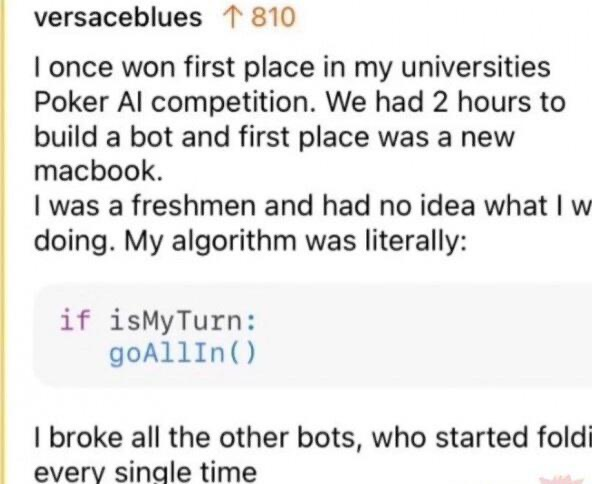
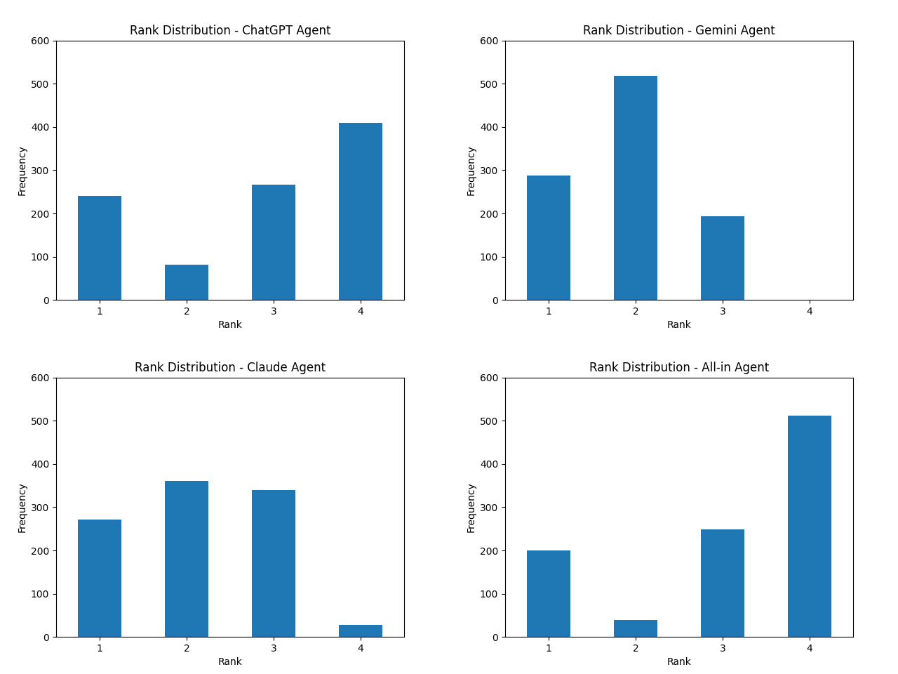
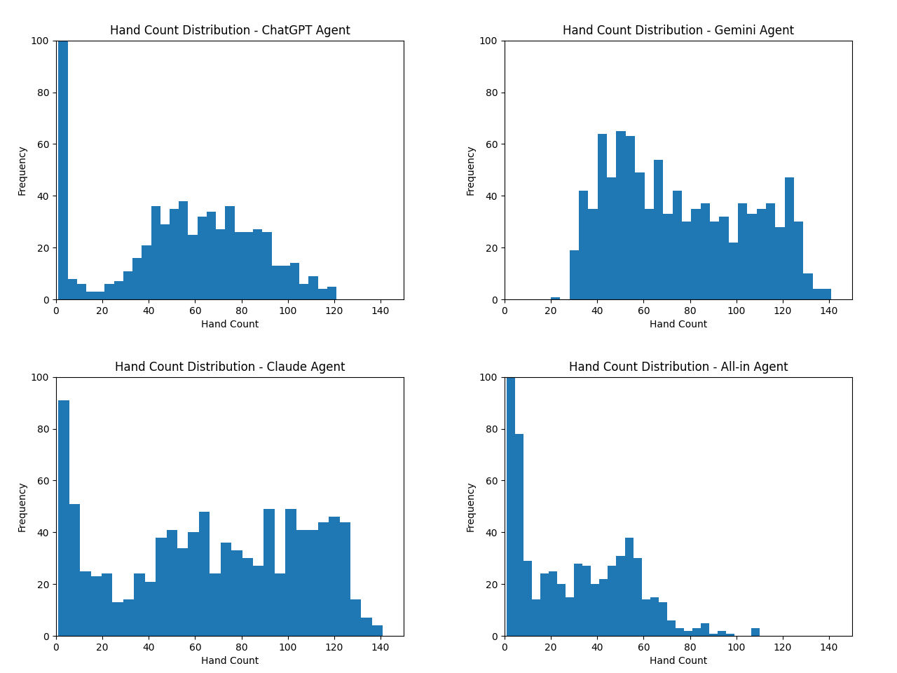
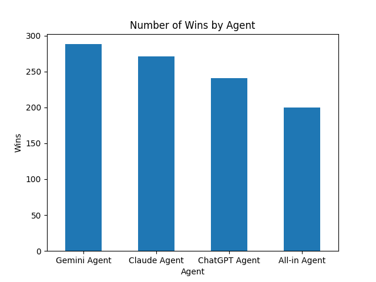

# Simulate a Poker Game with AI-generated Strategies

This project simulates No-Limit Texas Hold'em tournaments with configurable AI strategies.

## How It Started: Can AI Beat “Always All-In”?

This whole project began because I saw a meme online:  

Funny, right?

And that made me genuinely curious:

> Can an AI-written strategy actually beat a brainless “always all-in” strategy?

So, I decided to build a complete tournament engine and test it.

Later, this project evolved from a joke-inspired curiosity into a structured simulation framework for evaluating AI-generated poker strategies.

Join me on this journey and see what we can find out.

---

## Engine Architecture

The engine was designed with reproducibility and modularity in mind.

### Deterministic Seeds

At the core of everything is a **deterministic game seed**.

- Every game is initialized from a seed.
- All randomness is derived from that seed.
- No global randomness is used.

This ensures:
- Full reproducibility
- Fair comparison between strategies
- Controlled experimental conditions

If a game behaves strangely, I can rerun it exactly.

### Core Components

#### Game

A `Game` object:

- Holds a list of players
- Manages blind escalation
- Rotates the dealer button
- Spawns `Hand` objects
- Tracks hand count

The game escalates every **10 hands**, increasing pressure and forcing strategic adaptation.

#### Hand

A `Hand` object:

- Processes most game logic
- Handles betting rounds
- Manages pot resolution
- Determines elimination

The `Game` delegates detailed poker mechanics to `Hand`.

#### Player

A `Player` object stores:

- Stack size
- Betting state
- Stage totals
- Tournament rank

Each player contains an **Agent**, which makes decisions.

The player is the state holder.  
The agent is the brain.

#### Agents

Agents control player behavior.

There are two special agents:

- **All-in Agent**  
  Always goes all-in pre-flop. No logic. No evaluation. Pure chaos.

- **Input Agent**  
  Allows manual input for debugging and testing.

All other agents are AI-generated strategy implementations.

---

## Who Generated the Strategies?

I asked **4 AI chatbots** to generate complete strategies.  
The exact prompt can be found at `docs/prompt.md`.

The participants:

- **ChatGPT (Free Plan)**
- **Gemini 3 Pro Preview**
- **Claude Sonnet 4.6 Extended**
- **Grok (on X)**

---

## Code Quality Observations

All chatbots produced structured and reasonably sophisticated strategies.

However, **Grok** generated code with multiple bugs.

Because of this, Grok's agent remains in the source code but is disabled.

The other three models:

- Followed API constraints strictly
- Used provided randomness correctly
- Generated robust, error-free implementations

This demonstrates AI models' capability to generate robust API-compliant codes.

But do they have the capability to produce robust Poker strategies too? Let's see.

---

## Simulation Setup

All experiments were run under the following configuration:

- No-Limit Texas Hold’em
- 3000 initial chips per player
- Blind escalation every 10 hands
- 4 players per game, each controlled by:
  - ChatGPT Agent
  - Gemini Agent
  - Claude Agent
  - All-in Agent

A total of 1000 simulations were run.

For each game, the following data was recorded:

- `game_id`
- `game_seed`
- `agent_name`
- `rank`
- `hand_count`

This allowed structured statistical analysis and visualization.

---

## Experiment Results

### Rank Distribution

### Hand Count Distribution

Note that both the ChatGPT Agent and the All-in Agent show a pronounced spike in low hand-count games;
to make the chart readable, the y-axis was capped at 100, even though the actual counts are higher.

### Win Counts

---

## Analysis

### ChatGPT Agent — Aggressive and Confident

The ChatGPT-generated strategy plays aggressively.

It frequently:

- Calls all-ins at early stages
- Takes high-variance confrontations
- Competes directly against the All-in Agent

As a result:

- Its rank distribution resembles the All-in Agent.
- It busts early more often.
- But it still secures a meaningful number of wins.

This highlights an important insight:

> Player performance is heavily influenced by the behavior of other players.

In a table containing an extreme variance agent (All-in), aggressive players amplify variance by engaging with it.

### Gemini Agent — Extremely Patient

Gemini’s strategy is remarkably conservative.

At early stages:

- It avoids betting entirely.
- It rarely engages in marginal spots.

Only in later stages does it:

- Bet with strong hole cards
- Apply pressure when confident

A surprising result:

> Gemini Agent never finished last across 1000 simulations.

This is an extraordinary stability result.

Gemini sacrifices early chip accumulation but optimizes survival and laddering.

### Claude Agent — Balanced

Claude’s strategy lies between ChatGPT and Gemini.

- Not overly aggressive
- Not overly passive
- Selective engagement
- Moderate variance

Its performance reflects this balance:

- Competitive number of wins
- More stable than ChatGPT
- Slightly less dominant than Gemini

---

## Results Summary

After running thousands of simulations:

1. **Gemini Agent** gets No.1 rank the most.
2. **Claude Agent** comes second.
3. **ChatGPT Agent** follows.
4. **All-in Agent** ranks last overall.

However, one surprising detail:

> The All-in Agent still achieved around 200 wins.

Even a completely irrational strategy can win in a high-variance environment.

This reinforces a core tournament truth:

- High aggression increases variance.
- Variance occasionally produces first-place finishes.

---

## Takeaways

In this simulation setup:

> More aggressive = less effective

However:

Performance is not absolute.
It is ecological.

Population composition heavily affects results.

The original question was simple:

> Can AI beat “always all-in”?

The answer is "yes".

But the more interesting discovery is:

> Strategy strength depends on the environment it lives in.

---

## Future Directions

This setup invites deeper exploration:

- Different population compositions
- Larger player counts
- Evolutionary strategy mutation
- ICM-aware tournament logic
- Meta-strategy evolution

I'll pick things up again when I have some free time :)
